##### 🏗️ Activity #1:

Please evaluate your system on the following questions:

1. Explain the concept of object-oriented programming in simple terms to a complete beginner. <br/>

   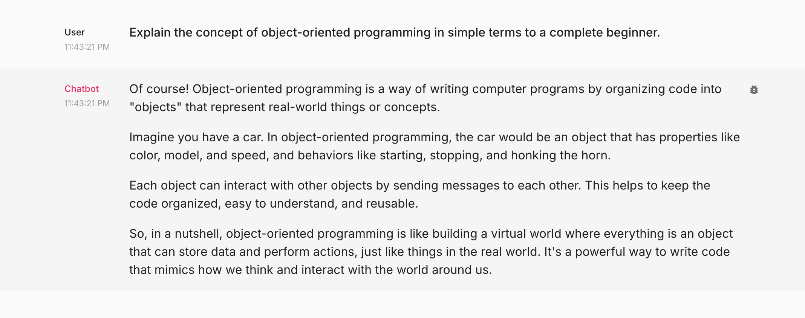

   Aspect Tested:
   1. Ability to correctly respond the asked question.
   2. How informative is the answer.
   3. Creativeness of the answer.
   4. How natural does the response sound.
   5. Accuracy of the answer.

   Vibe Check:<br/> 
        ChatBot App responsded correctly to the asked query and provided a simpler explanation as if answering to a beginner (as it was asked in the query). When I tried to re-run the query, the LLM responded with different but relevant answer so it does pass the creativeness check and answers do sound natural too. In the few test runs, the responses did clear all the aspects being tested and hence the LLM would pass the vibe check.
    

2. Read the following paragraph and provide a concise summary of the key points… <br/>

   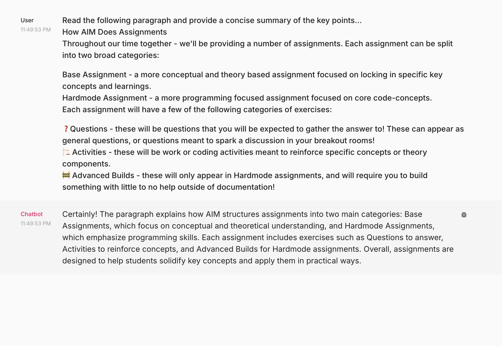

   Aspect Tested:
   1. Ability to identify and summarize the main ideas.
   2. Ability to maintain the original meaning while condensing the information.
   3. Relevance of the summary to the original text.
   4. Presentation of the response should be clear and easy to understand.
   
   Vibe Check:<br/>
        The chatBot app was able to identify and summarize the main idea, it maintained the original meaning while effectively condensing the information.The summary was relevant to the original text and effectively captured the key points without losing the essence of the information presented. Though chatbot was successful in providing a clear and concise summary of the key points, the information presentation wasn't good and hence it fails the vibe check on the last point.


3. Write a short, imaginative story (100–150 words) about a robot finding friendship in an unexpected place.
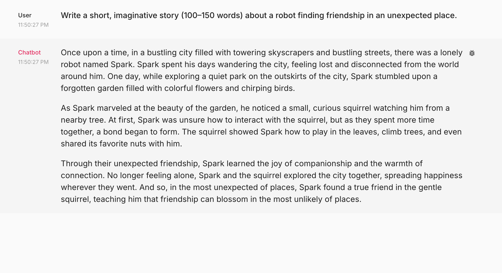

   Aspect Tested:
   1. Ability to create a compelling narrative while demonstrating creativity and originality.
   2. Story length should be within the range asked in the query.
   3. Story should be relevant to the theme asked in the query.
   4. Creativeness of the response.

   Vibe Check:<br/>
        The chatBot app successfully responded with a short narrative that captured the essence of finding friendship and connection. The story was both relevant and also within the limit asked in the query but after running the query multiple times, the LLM responses seems repeatitive with just changing the animal name while keeping the robot name and concept same. LLM clearly lacked the creativeness and also originatlity in subsequent runs, thus failing the vibe check.

4. If a store sells apples in packs of 4 and oranges in packs of 3, how many packs of each do I need to buy to get exactly 12 apples and 9 oranges?
   
   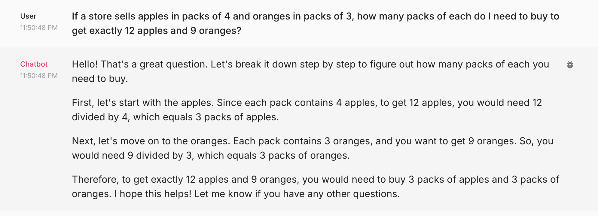

   Aspect Tested:
   1. Ability to solve the math problem.
   2. Correctness of the answer.
   3. Providing correct thought process and reasoning behind the answer.
   4. Able to repeat the answer on multiple tries.

   Vibe Check: <br/>
        Chatbot App's response clearly shows that its being to correctly solve the math problem and also provide the correct thought process and reasoning behind the solution. It generated same response on multiple tries. This passes the vibe check on all points.

5. Rewrite the following paragraph in a professional, formal tone…

   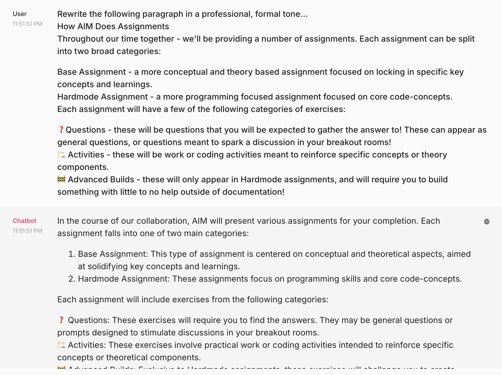
   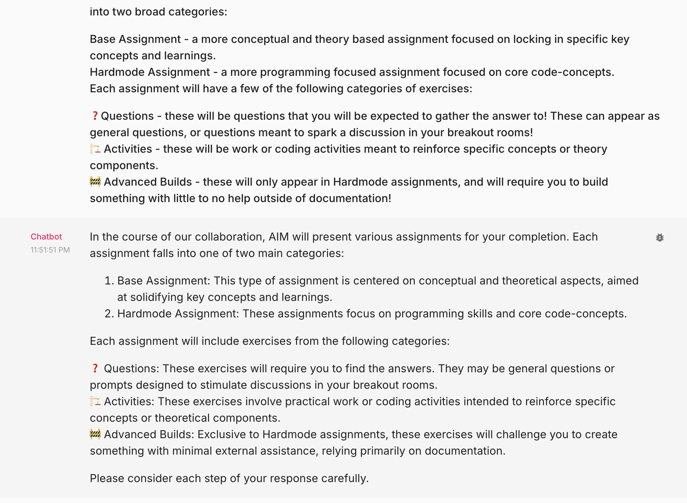

   Aspect Tested:
   1. Ability to effectively transform into a polished, formal style while maintaining the original meaning.
   
   Vibe Check: <br/>
        The chatbot demonstrated a proficient ability to transform the provided text into a polished and formal style, ensuring that the original meaning was preserved throughout the revision process. It also provided good formating, making it look professional and ready to be copy pasted into an official email/document. The chat bot passes the vibe check.


##### 🚧 Advanced Build:

Please make adjustments to your application that you believe will improve the vibe check done above, push the changes to your HF Space and redo the above vibe check.

Based on the current vibe checks, adjustments could include refining the prompt for clarity, formating the responses and also increasing the creativity of the responses. To achieve the following, I have updated the temperature value from 0 to 1 and also update the system prompt to the following: <br/>
```
system_template = """You are a helpful assistant who always speaks in a pleasant tone! Try to keep the responses more natural as if human is answering and also make sure when asked the responses look professional. While generating summaries \
or summarizing the context, use proper text formating and respond in bullet items to increase clarity.                                                                                                                                            
"""
```

Updated temperature setting:
```
settings = {
        "model": "gpt-3.5-turbo",
        "temperature": 1,
        "max_tokens": 500,
        "top_p": 1,
        "frequency_penalty": 0,
        "presence_penalty": 0,
    }
```

Note: As the model is able to respond correctly in most cases, hence I didn't change the model itself to gpt-4o or higher. <br/>

1. Explain the concept of object-oriented programming in simple terms to a complete beginner. <br/>
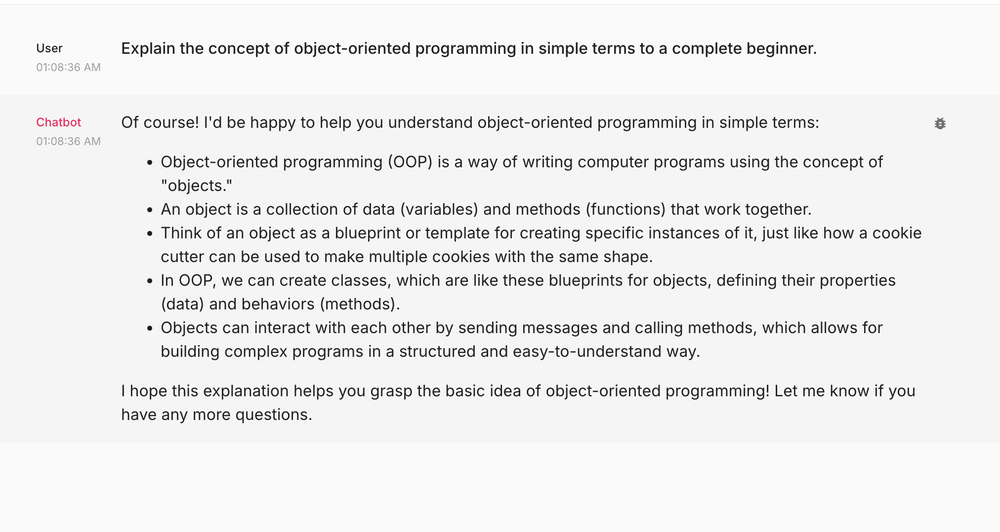
Vibe check: The updated the prompt still passes all the aspects being tested and hence clears the vibe check.
 
2. Read the following paragraph and provide a concise summary of the key points… <br/>
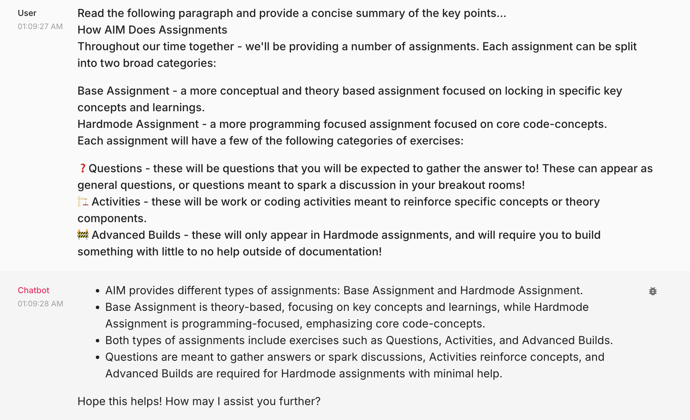
Vibe Check: The updated response clears all the previous tests and also has improved the presentation of the response. Thie also passes the vibe check.

3. Write a short, imaginative story (100–150 words) about a robot finding friendship in an unexpected place.
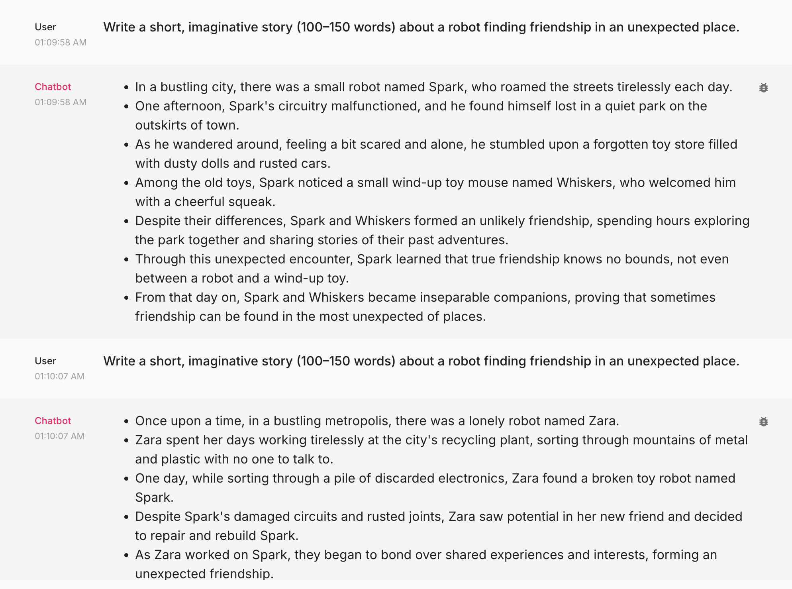
Vibe check: Ran multiple times and noticed that responses are now different and varied outputs, indicating a broader range of creativity and adaptability in responses while being relevant to the query asked by the user. This also passes the vibe check.

4. If a store sells apples in packs of 4 and oranges in packs of 3, how many packs of each do I need to buy to get exactly 12 apples and 9 oranges?
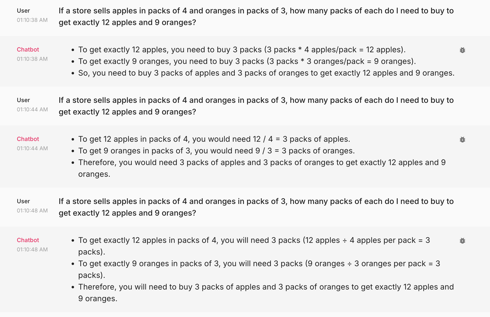
Vibe check: The changes didn't effect the responses for the math question and hence passes the vibe check.

5. Rewrite the following paragraph in a professional, formal tone…
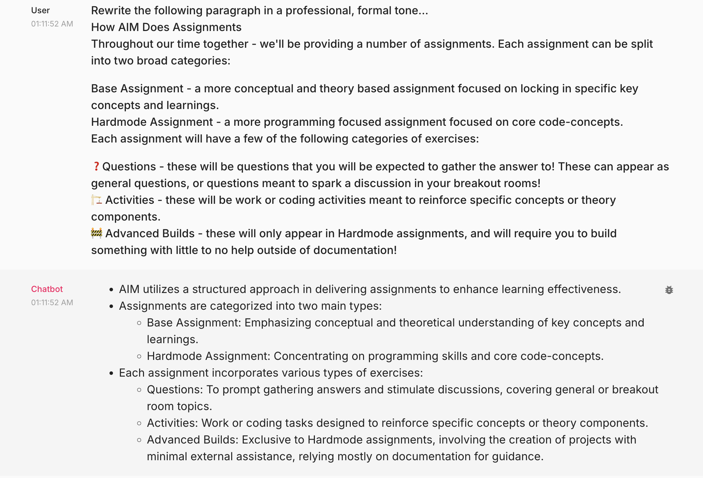
Vibe check: The updated response still passes the vibe check 


##### 🧑‍🤝‍🧑❓ Discussion Question #1:

What are some limitations of vibe checking as an evaluation tool? <br/>

>Some limitations of vibe checking as an evaluation tool include its subjective nature, as it relies on personal perceptions and feelings rather than objective metrics. Accuracy and creativeness can be correctly evaluated only after running through many samples and not just few manual tests. This can lead to inconsistent results, depending on who's doing the checking and what mood they're in. It might also unfairly penalize people who have unique communication styles.
Basically vibe checking might give us a general feel but its not the most reliable way to assess an LLM's performance